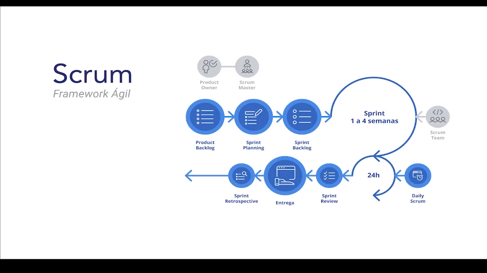

# Style Guide

Guia de estilo que serve para planejar como será feita a interface.

## Componentes - User Interface Design

Um produto desenvolvido por desenvolvedores para que outros desenvolvedores possam utilizar.

- Padronização;
- Reutilização;
- Produtividade.

### Ferramentas

- Material Design;
- bold_

## Agilidade 
 
 ### Processos de Desenvolvimento
 - Trabalho em equipe
 - Ciclos Incrementais
 - Geração de conhecimento

## SCRUM 
Framework Ágil

- Product Backlog: é uma lista de tarefas que devem ser aplicadas no projeto. 
- Sprint Planning: planejamento que serão executadas e priorizadas durante a sprint.
- Sprint Backlog: conjunto de tarefas que devem ser executadas e desenvolvidas em um período de tempo pré-definido.

## XP (eXtreme Programing)

Programação extrema, ou simplesmente XP, é considerada uma metodologia ágil e se ajusta bem a projetos de software com requisitos vagos e em constante mudança. Para isso, adota a estratégia de constante acompanhamento e realização de vários pequenos ajustes durante o desenvolvimento de software.

## Kanban (Just-in-time)

Em administração da produção, Kanban é um quadro de sinalização que controla os fluxos de produção ou transportes em uma indústria. O cartão pode ser trocado por outro sistema de sinalização, como luzes, caixas vazias e até locais vazios demarcados.

# SDE (Software Development Enviroment)

- Desenvolvimento
- Beta
- Produção

## Web Server (Servidores Web)

- Hospedagem compartilhada;
- Iaas - Infraestrutura as a Service;
- PaaS - Platform as a Service;
- SaaS - Software as a Service.

## Testes 

- Funcional;
- Regressivo;
- Unitários;
- Segurança;
- Performance. 